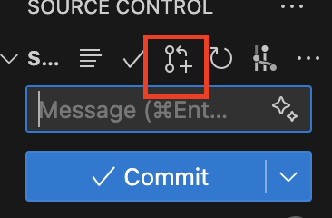

# 📚 BookNest — Local Bookstore Landing Page

## 🚀 Running the Project

```bash
# 1. Clone the repository
git clone git@github.com:AnnetDev/BookNest.git

# 2. Navigate into the folder
cd BookNest

# 3. Install dependencies
npm install

# 4. Start the development server
npm run dev

# 5. Open the project in your browser
# (Vite will usually start on http://localhost:5173)
```

## Rules for branches and pull requests

This is the standard workflow our team follows.
Please use these rulles and follow these steps to avoid merge conflicts and keep the repository clean.

``` bash
# 1. 🧹 Always start by updating the main branch. Switch to main and pull the latest updates:

git checkout main

git pull

# 2. 🌿 Create your feature branch from the updated main. Name your branch according to your task (feature/footer as example)

git checkout -b "your branch name"

## This will also switch you to the new branch.

# 3. 🛠 Do your work inside your feature branch. Add and commit your changes, push to your remote branch in GitHub.

# 4. 🔄 Before creating a Pull Request, update your branch (align with main):
    # 4.1 Switch to main:
    git checkout main

    # 4.2 Pull updates:
    git pull

    # 4.3 Go back to your feature branch:
    git checkout "your branch name"

    # 4.4 Merge the updated main into your branch:
    git merge origin/main

    # 4.5 If there are conflicts: resolve them carefully + make sure you do not break main’s current logic

    # 4.6 Commit the merge:
    git add .
    git commit -m "merge: update branch from main"

    # 4.7 Push your updated branch:
    git push

# 5. Create a Pull Request in VsCode or GitHub
# button in VsCode:


```


# About BookNest

**Client:** Johan, Owner of BookNest  
**Type:** Student Project / Mobile-First Prototype  

A **mobile-first landing page** for a local bookstore going online. Users can browse books, discover new arrivals, and add favorites to a wishlist — all in a clean, responsive interface.  

---

## 🎯 Goals
- Browse books and scroll through **new arrivals**  
- Add books to a **wishlist** ❤️  
- Highlight **popular/recommended titles**  

---

## 🧩 Key Features
- Mobile-first **responsive layout**  
- **Interactive “Add to Wishlist”** buttons  
- **Highlighted promotions** and new arrivals  
- Simple, clean, and modern UI  

---

## ⚡ Challenge
Design a **mobile-first experience** that is intuitive, visually appealing, and easy to navigate for all users, including non-tech-savvy visitors.

---

## 🚀 Tools & Deliverables
- **Wireframes & Layout Sketches**  
- **HTML/CSS Mobile-First Prototype**  
- Usability insights & iterative improvements  

---

## 🌐 Live Demo
🚀 [View BookNest Prototype](https://gameprediction.netlify.app)  

> Perfect example of turning a design brief into a working interactive prototype.
